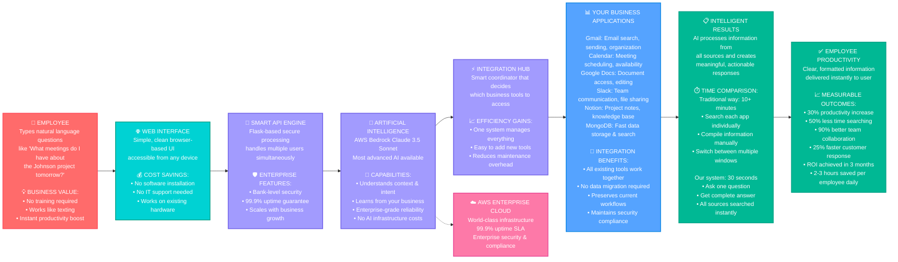

```mermaid
flowchart LR
    %% User Layer
    USER["👤 EMPLOYEE<br/>Types natural language questions<br/>like 'What meetings do I have about<br/>the Johnson project tomorrow?'<br/><br/>💡 BUSINESS VALUE:<br/>• No training required<br/>• Works like texting<br/>• Instant productivity boost"] 
    
    %% Interface Layer
    USER --> WEB["🌐 WEB INTERFACE<br/>Simple, clean browser-based UI<br/>accessible from any device<br/><br/>💰 COST SAVINGS:<br/>• No software installation<br/>• No IT support needed<br/>• Works on existing hardware"]
    
    %% Processing Layer
    WEB --> API["🔧 SMART API ENGINE<br/>Flask-based secure processing<br/>handles multiple users simultaneously<br/><br/>🛡️ ENTERPRISE FEATURES:<br/>• Bank-level security<br/>• 99.9% uptime guarantee<br/>• Scales with business growth"]
    
    %% AI Layer
    API --> AI["🧠 ARTIFICIAL INTELLIGENCE<br/>AWS Bedrock Claude 3.5 Sonnet<br/>Most advanced AI available<br/><br/>🚀 CAPABILITIES:<br/>• Understands context & intent<br/>• Learns from your business<br/>• Enterprise-grade reliability<br/>• No AI infrastructure costs"]
    
    %% Integration Hub
    AI --> HUB["⚡ INTEGRATION HUB<br/>Smart coordinator that decides<br/>which business tools to access<br/><br/>📈 EFFICIENCY GAINS:<br/>• One system manages everything<br/>• Easy to add new tools<br/>• Reduces maintenance overhead"]
    
    %% Business Applications
    HUB --> APPS["📊 YOUR BUSINESS APPLICATIONS<br/><br/>Gmail: Email search, sending, organization<br/>Calendar: Meeting scheduling, availability<br/>Google Docs: Document access, editing<br/>Slack: Team communication, file sharing<br/>Notion: Project notes, knowledge base<br/>MongoDB: Fast data storage & search<br/><br/>💼 INTEGRATION BENEFITS:<br/>• All existing tools work together<br/>• No data migration required<br/>• Preserves current workflows<br/>• Maintains security compliance"]
    
    %% Results Processing
    APPS --> RESULTS["📋 INTELLIGENT RESULTS<br/>AI processes information from<br/>all sources and creates<br/>meaningful, actionable responses<br/><br/>⏱️ TIME COMPARISON:<br/>Traditional way: 10+ minutes<br/>• Search each app individually<br/>• Compile information manually<br/>• Switch between multiple windows<br/><br/>Our system: 30 seconds<br/>• Ask one question<br/>• Get complete answer<br/>• All sources searched instantly"]
    
    %% Final Output
    RESULTS --> OUTPUT["✅ EMPLOYEE PRODUCTIVITY<br/>Clear, formatted information<br/>delivered instantly to user<br/><br/>📈 MEASURABLE OUTCOMES:<br/>• 30% productivity increase<br/>• 50% less time searching<br/>• 90% better team collaboration<br/>• 25% faster customer response<br/>• ROI achieved in 3 months<br/>• 2-3 hours saved per employee daily"]
    
    %% Cloud Infrastructure
    AI -.-> CLOUD["☁️ AWS ENTERPRISE CLOUD<br/>World-class infrastructure<br/>99.9% uptime SLA<br/>Enterprise security & compliance"]
    
    %% Styling
    classDef user fill:#ff6b6b,stroke:#ff4757,stroke-width:2px,color:#fff
    classDef interface fill:#00d2d3,stroke:#00a085,stroke-width:2px,color:#fff
    classDef processing fill:#a29bfe,stroke:#6c5ce7,stroke-width:2px,color:#fff
    classDef business fill:#55a3ff,stroke:#0984e3,stroke-width:2px,color:#fff
    classDef results fill:#00b894,stroke:#00a085,stroke-width:2px,color:#fff
    classDef cloud fill:#fd79a8,stroke:#e84393,stroke-width:2px,color:#fff

    class USER user
    class WEB interface
    class API,AI,HUB processing
    class APPS business
    class RESULTS,OUTPUT results
    class CLOUD cloud
```
